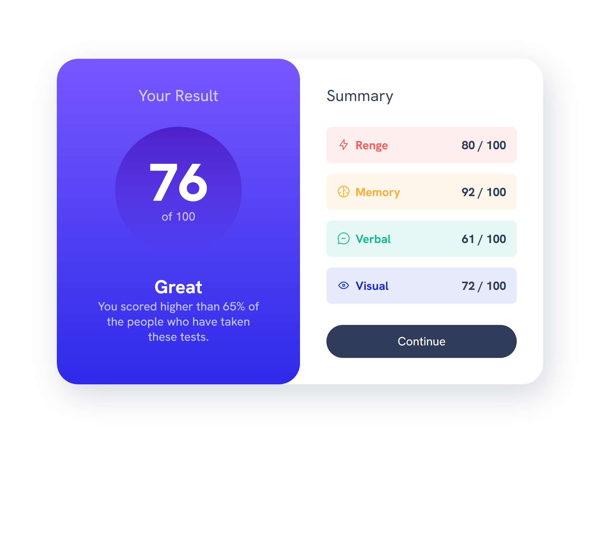

# Frontend Mentor - Results summary component solution

This is a solution to the [Results summary component challenge on Frontend Mentor](https://www.frontendmentor.io/challenges/results-summary-component-CE_K6s0maV). Frontend Mentor challenges help you improve your coding skills by building realistic projects.

## Table of contents

- [Overview](#overview)
  - [The challenge](#the-challenge)
  - [Screenshot](#screenshot)
  - [Links](#links)
- [My process](#my-process)
  - [Built with](#built-with)
  - [What I learned](#what-i-learned)
  - [Continued development](#continued-development)
  - [Useful resources](#useful-resources)
- [Author](#author)
- [Acknowledgments](#acknowledgments)


## Overview

### The challenge

Users should be able to:

- View the optimal layout for the interface depending on their device's screen size
- See hover and focus states for all interactive elements on the page
- **Bonus**: Use the local JSON data to dynamically populate the content

### Screenshot




### Links

- Solution URL: [Add solution URL here](https://github.com/sledua/results-summary-component-main)
- Live Site URL: [Add live site URL here](https://main--chimerical-llama-ff8d34.netlify.app/)

## My process

### Built with

- Semantic HTML5 markup
- CSS custom properties
- Flexbox
- CSS Grid
- Mobile-first workflow
- [React](https://reactjs.org/) - JS library
- [Next.js](https://nextjs.org/) - React framework
- [Styled Components](https://styled-components.com/) - For styles


### What I learned

Use this section to recap over some of your major learnings while working through this project. Writing these out and providing code samples of areas you want to highlight is a great way to reinforce your own knowledge.

To see how you can add code snippets, see below:

```html
<div class="summary-item" data-item-type="accent-1">
  <div class="flex-group">
    <svg class="summary-icon"></svg>
    <h3 class="summary-item-title">Renge</h3>
  </div>
  <p class="summary-score"><span>80</span> / 100</p>
</div>
```

```css
.summary-item {
  display: flex;
  justify-content: space-between;
  align-items: center;
  padding: 1rem;
  border-radius: 0.5rem;
  background-color: hsl(var(--item-color), 0.1);
}
.summary-item svg {
  stroke: hsl(var(--item-color));
}
.summary-item[data-item-type="accent-1"] {
  --item-color: var(--clr-accent-1);
}
```

### Continued development

In future development, I plan to use the method of selective links to a separate part of the layout very actively, it's really cool. I'm also going to take a closer look at how fast and fun it is to do dynamic data loading via json files. And thanks to Kevin for such a great opportunity to get back to learning interesting features.

### Useful resources

- [From Design to Code // HTML & CSS from scratch // Frontend Mentor](https://www.youtube.com/watch?v=KqFAs5d3Yl8&t=1813s&ab_channel=KevinPowell) - TI watched and repeated after the author to get a chance to quickly return to studying.

## Author

- Website - [Github](https://github.com/sledua)
- Frontend Mentor - [@sledua](https://www.frontendmentor.io/profile/sledua)
- Twitter - [@sled_artem](https://twitter.com/sled_artem)

## Acknowledgments

Kevin Powell is a very cool person, for someone who just knows you from YouTube, I really learned from you, the right approach to stretching the layout, to the state of how to quickly get back up and go on an interesting path, you are a top YouTube guy)
